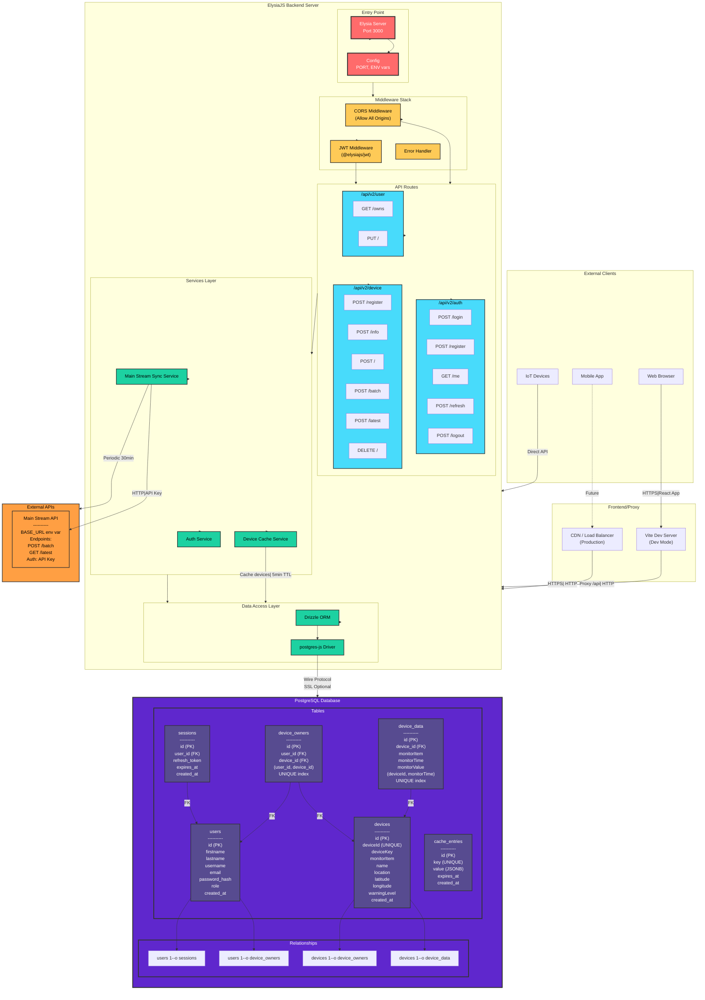
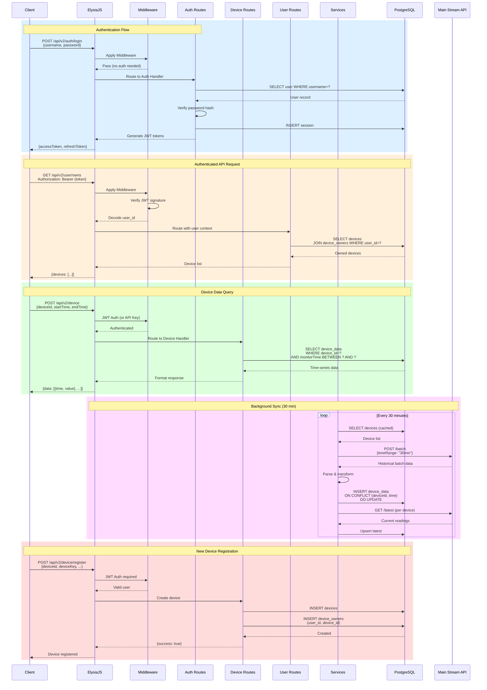
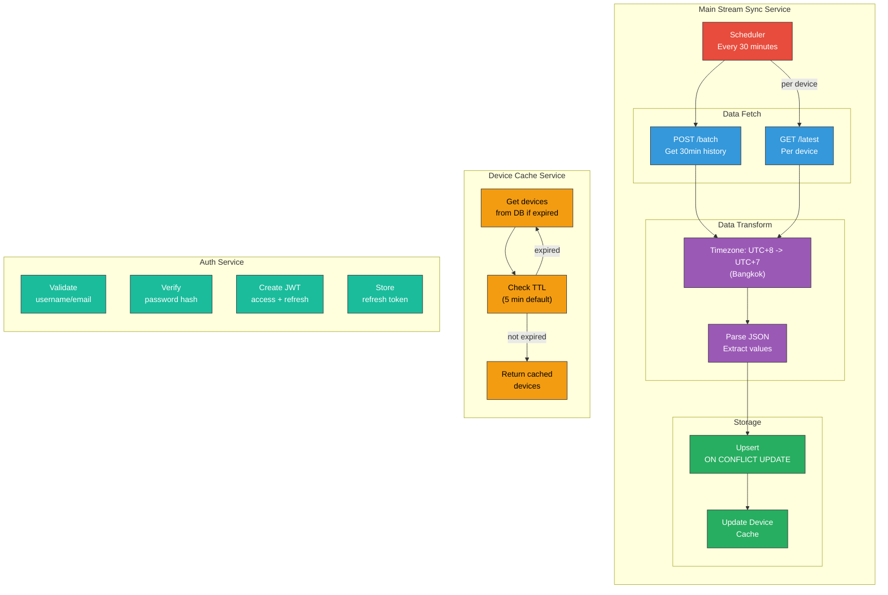
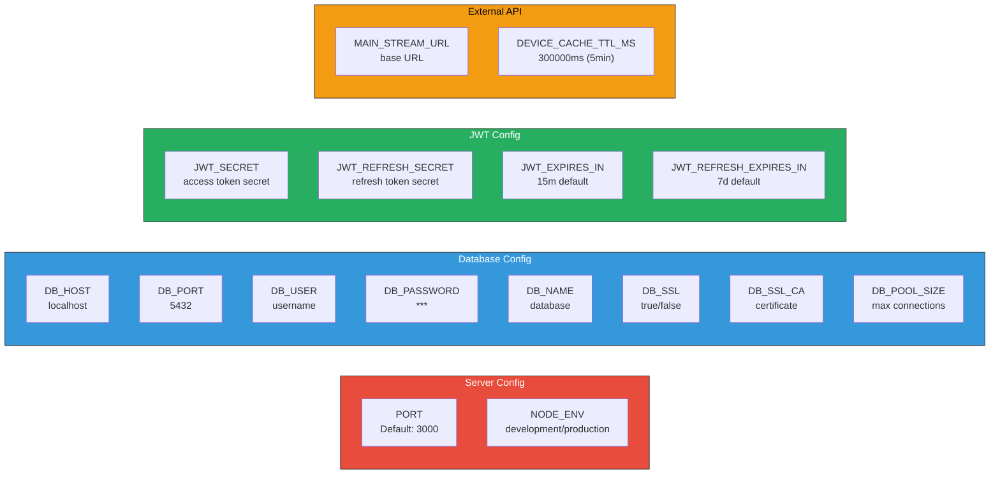

# Backend Architecture Diagram



## Request/Response Flow



## Database Schema

```mermaid
erDiagram
    users ||--o{ sessions : "has"
    users ||--o{ device_owners : "owns"
    devices ||--o{ device_owners : "belongs to"
    devices ||--o{ device_data : "has readings"

    users {
        uuid id PK
        string firstname
        string lastname
        string username UK
        string email UK
        string password_hash
        string role
        timestamp created_at
    }

    sessions {
        uuid id PK
        uuid user_id FK
        string refresh_token
        timestamp expires_at
        timestamp created_at
    }

    devices {
        uuid id PK
        string deviceId UK
        string deviceKey
        string monitorItem
        string name
        string location
        float latitude
        float longitude
        int warningLevel
        timestamp created_at
    }

    device_owners {
        uuid id PK
        uuid user_id FK
        uuid device_id FK
        timestamp created_at
    }

    device_data {
        uuid id PK
        uuid device_id FK
        string monitorItem
        timestamp monitorTime
        float monitorValue
    }

    device_data {
        unique_index "deviceId + monitorTime"
    }

    device_owners {
        unique_index "user_id + device_id"
    }

    cache_entries {
        uuid id PK
        string key UK
        jsonb value
        timestamp expires_at
        timestamp created_at
    }
```

## Service Architecture



## Environment Variables



---

## API Endpoints

### Auth Routes `/api/v2/auth`

| Method | Endpoint | Auth | Description |
|--------|----------|------|-------------|
| POST | /login | No | Login with username/email + password |
| POST | /register | No | Register new user |
| GET | /me | Bearer | Get current authenticated user |
| POST | /refresh | No | Refresh access token |
| POST | /logout | Bearer | Logout (delete all sessions) |

### Device Routes `/api/v2/device`

| Method | Endpoint | Auth | Description |
|--------|----------|------|-------------|
| POST | /register | Bearer | Register a new device |
| POST | /info | Bearer | Get device info |
| DELETE | / | Bearer | Delete a device |
| POST | / | API Key | Query device data for time range |
| POST | /batch | API Key | Query multiple devices data |
| POST | /latest | No | Get latest reading from Main Stream (proxied) |

### User Routes `/api/v2/user`

| Method | Endpoint | Auth | Description |
|--------|----------|------|-------------|
| GET | /owns | Bearer | Get all devices owned by user |
| PUT | / | Bearer | Update user profile |

## Tech Stack

| Category | Technology |
|----------|------------|
| Framework | ElysiaJS |
| Language | TypeScript |
| ORM | Drizzle ORM |
| Database | PostgreSQL |
| Auth | JWT (@elysiajs/jwt) |
| Database Driver | postgres-js |

## Project Structure

```
Backend/
├── src/
│   ├── index.ts           # Entry point
│   ├── services/
│   │   └── mainStream.ts  # Main Stream sync service
│   ├── db/
│   │   ├── database.ts    # DB connection
│   │   └── schema.ts      # Drizzle schema
│   └── api/
│       └── v2/
│           ├── auth.ts    # Auth routes
│           ├── device.ts  # Device routes
│           └── user.ts    # User routes
├── package.json
├── tsconfig.json
└── docker-compose.yml
```

## Usage

### VS Code Extension
Install **Mermaid Markdown Syntax Highlighting** or **Mermaid Preview**

### Online Editor
[Mermaid Live Editor](https://mermaid.live) - paste code and view

### Export to PNG/SVG
```bash
npm install -g @mermaid-js/mermaid-cli
mmdc -i input.md -o output.png -b dark
```