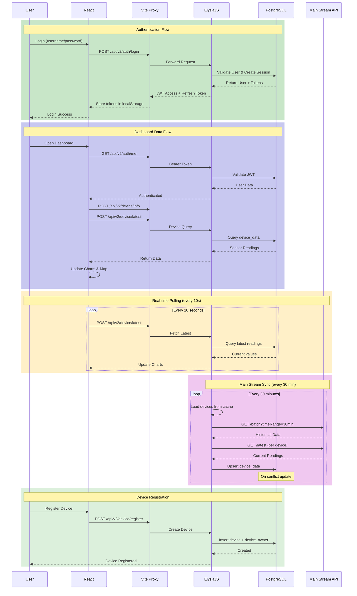
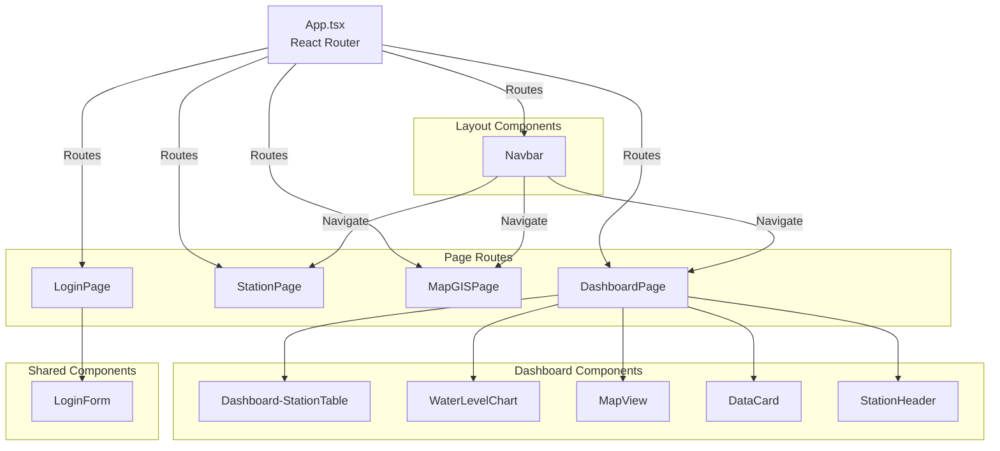
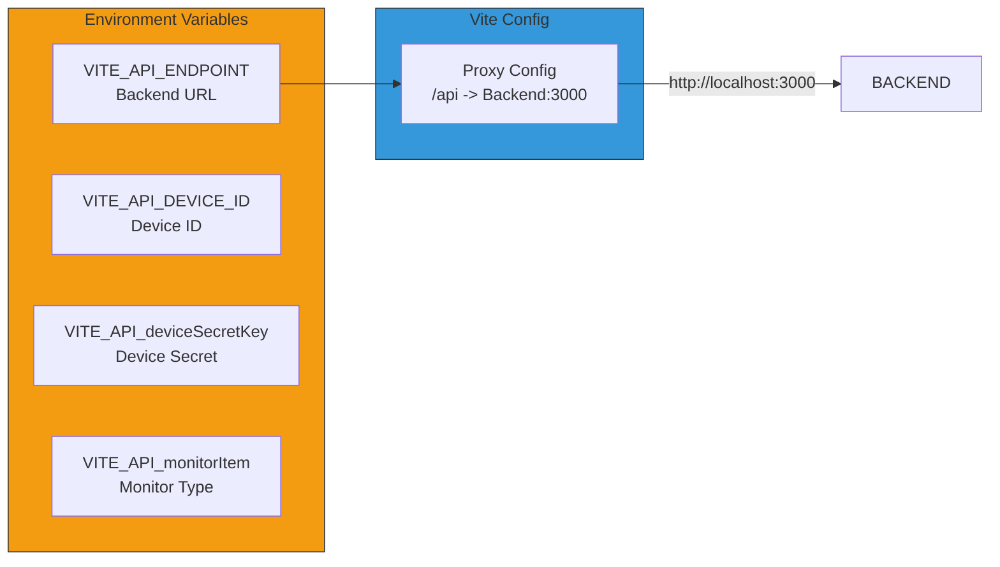

# Frontend Architecture Diagram

```mermaid
graph TB
    subgraph CLIENTS["Clients"]
        Browser["Web Browser<br/>(React + Vite)"]
        Mobile["Mobile App<br/>(Future)"]
    end

    subgraph FRONTEND["Frontend Layer"]
        direction TB
        ViteServer["Vite Dev Server<br/>/ Production Build"]
        
        subgraph PAGES["Pages"]
            DashboardPage["DashboardPage"]
            StationPage["Station"]
            MapGISPage["MapGISPage"]
            LoginPage["LoginPage"]
        end
        
        subgraph COMPONENTS["Components"]
            Navbar["Navbar"]
            WaterLevelChart["WaterLevelChart"]
            MapView["MapView"]
            MapGIS["MapGIS"]
            DataCard["DataCard"]
            StationTable["StationTable"]
            LoginForm["LoginForm"]
        end
        
        subgraph SERVICES["Services"]
            DeviceService["deviceService.ts"]
        end
        
        subgraph STYLES["Styles"]
            CSSModules["CSS Modules"]
        end
    end

    subgraph API_PROXY["API Proxy"]
        ViteProxy["Vite Proxy<br/>/api -> Backend:3000"]
    end

    subgraph BACKEND["Backend Layer"]
        ElysiaServer["ElysiaJS Server<br/>:3000"]
        
        subgraph MIDDLEWARE["Middleware"]
            CORS["CORS<br/>(Allow All)"]
            JWT["JWT Auth<br/>(@elysiajs/jwt)"]
        end
        
        subgraph API_ROUTES["API Routes"]
            AuthRoutes["/api/v2/auth<br/>login, register, me, refresh, logout"]
            DeviceRoutes["/api/v2/device<br/>register, info, latest, batch"]
            UserRoutes["/api/v2/user<br/>owns, update"]
        end
        
        subgraph SERVICES_BACK["Services"]
            MainStreamSync["Main Stream Sync<br/>(30 min interval)"]
            DeviceCache["Device Cache<br/>(5 min TTL)"]
        end
        
        subgraph DATABASE_ACCESS["Data Access Layer"]
            DrizzleORM["Drizzle ORM"]
        end
    end

    subgraph DATABASE["Database - PostgreSQL"]
        UsersTable["users<br/>id, email, username,<br/>password, role"]
        DevicesTable["devices<br/>id, deviceId, deviceKey,<br/>name, location, warningLevel"]
        SessionsTable["sessions<br/>id, user_id, token,<br/>expires"]
        DeviceDataTable["device_data<br/>id, device_id, monitorItem,<br/>monitorTime, value"]
        DeviceOwnersTable["device_owners<br/>user_id, device_id"]
        CacheEntriesTable["cache_entries<br/>key, value, expires"]
    end

    subgraph EXTERNAL["External Systems"]
        MainStreamAPI["Main Stream API<br/>/batch, /latest"]
    end

    Browser -->|"HTTP/HTTPS|React Router"| ViteServer
    Mobile -.->|"Future"| ViteServer
    
    ViteServer --> PAGES
    ViteServer --> COMPONENTS
    ViteServer --> SERVICES
    ViteServer --> STYLES
    
    SERVICES -->|"API Calls"| ViteProxy
    DashboardPage -->|"/device/info, /device/latest"| DeviceService
    WaterLevelChart -->|poll /device/latest<br/>every 10s| DeviceService
    LoginForm -->|"/auth/login, /auth/register"| DeviceService
    
    ViteProxy -->|"HTTP REST| JWT Bearer"| BACKEND
    
    ElysiaServer --> MIDDLEWARE
    MIDDLEWARE --> CORS
    MIDDLEWARE --> JWT
    CORS --> API_ROUTES
    JWT --> API_ROUTES
    API_ROUTES --> AuthRoutes
    API_ROUTES --> DeviceRoutes
    API_ROUTES --> UserRoutes
    
    API_ROUTES --> SERVICES_BACK
    ServicesBack["Services"] --> DrizzleORM
    MainStreamSync -->|"FETCH /batch, /latest"| EXTERNAL
    MainStreamSync --> DrizzleORM
    DeviceCache -->|"Cache devices<br/>from DB"| DrizzleORM
    
    DrizzleORM --> DATABASE
    DATABASE --> UsersTable
    DATABASE --> DevicesTable
    DATABASE --> SessionsTable
    DATABASE --> DeviceDataTable
    DATABASE --> DeviceOwnersTable
    DATABASE --> CacheEntriesTable
    
    EXTERNAL --> MainStreamAPI
    
    PAGES --> CSSModules
    COMPONENTS --> CSSModules

    classDef frontend fill:#61dafb,stroke:#333,stroke-width:2px,color:#000
    classDef backend fill:#ff6b6b,stroke:#333,stroke-width:2px,color:#fff
    classDef database fill:#f7df1e,stroke:#333,stroke-width:2px,color:#000
    classDef external fill:#9b59b6,stroke:#333,stroke-width:2px,color:#fff
    classDef client fill:#27ae60,stroke:#333,stroke-width:2px,color:#fff
    
    class Browser,Mobile client
    class FRONTEND,ViteServer,PAGES,COMPONENTS,SERVICES,STYLES frontend
    class BACKEND,ElysiaServer,MIDDLEWARE,API_ROUTES,SERVICES_BACK,DATABASE_ACCESS backend
    class DATABASE,UsersTable,DevicesTable,SessionsTable,DeviceDataTable,DeviceOwnersTable,CacheEntriesTable database
    class EXTERNAL,MainStreamAPI external
```



## Data Flow Diagram



## Component Hierarchy



## Environment Configuration



---

## Tech Stack

| Category | Technology |
|----------|------------|
| Framework | React 19.2 + TypeScript |
| Build Tool | Vite 7.2 |
| Routing | React Router v7 |
| Charts | Recharts 3.7 |
| Maps | Leaflet + react-leaflet 5.0 |
| Icons | Lucide React |
| Styling | CSS Modules |
| Auth | JWT (localStorage) |

## Project Structure

```
Frontend/src/
├── main.tsx              # Entry point
├── App.tsx               # Root component with routing
├── index.css             # Global styles
├── components/           # Reusable UI components
│   ├── Navbar.tsx
│   ├── LoginForm.tsx
│   ├── DataCard.tsx
│   ├── WaterLevelChart.tsx
│   ├── MapView.tsx
│   ├── MapGIS.tsx
│   ├── StationTable.tsx
│   ├── Station.ts
│   ├── Dashboard-StationTable.tsx
│   └── StationHeader.tsx
├── pages/                # Page-level components
│   ├── DashboardPage.tsx
│   ├── LoginPage.tsx
│   ├── Station.tsx
│   └── MapGISPage.tsx
├── service/              # API services
│   └── deviceService.ts
├── data/                 # Static data
│   └── stationList.ts
└── styles/               # CSS modules
```

## Usage

### VS Code Extension
Install **Mermaid Markdown Syntax Highlighting** or **Mermaid Preview**

### Online Editor
[Mermaid Live Editor](https://mermaid.live) - paste code and view

### Export to PNG/SVG
```bash
npm install -g @mermaid-js/mermaid-cli
mmdc -i input.md -o output.png -b dark
```